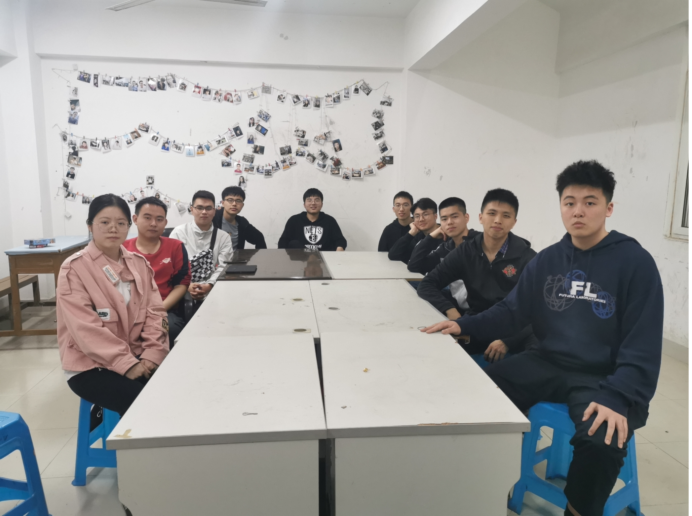
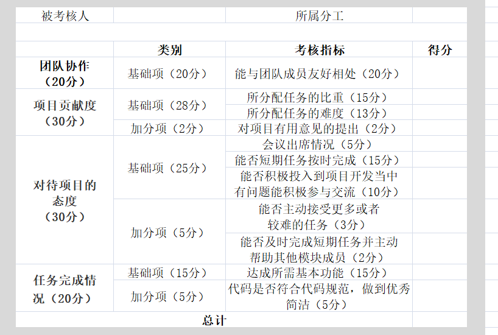

# Growing light——团队展示

|这个作业属于哪个课程    |[软件工程2021春软件工程W班(FZU)](https://edu.cnblogs.com/campus/fzu/2021SpringSoftwareEngineeringPractice/)  |
|:---|:---|
|作业要求   |[作业链接](https://edu.cnblogs.com/campus/fzu/2021SpringSoftwareEngineeringPractice/homework/11848)  |
|团队名称  |  Growing light	 |
|作业目标  |  1.组建团队；2.确定项目展示队友风采；3.队友合照；4.绩效考核方案；5.团队愿景。   |
|参考文献  |  无	 |
                                                                         
                                                            
                                                            
## 团队名称
>**Growing light**——一棵树摇动一棵树，一朵云推动一朵云，一个灵魂唤醒一个灵魂。
## 团队项目描述
>**山烛**——一款线上扶贫教育平台，为贫困地区孩子提供更多的教育机会，也能为想要支教而无法前往贫困山区的热心人士提供一个贡献自己力量的开放式平台。
## 队员风采

| 成员名 | cold |
| :--------: | :--------: |
| 学号     | 221801424     |
| 博客园地址     | [Link](https://www.cnblogs.com/coldsu/)    |
| 成员性格    | 外向开朗好说话     |
| 擅长技术     | flask，vue等     |
| 兴趣爱好     | 打篮球，玩游戏，看视频，唱歌    |
| 希望的软工角色     | 前端，后端，测试     |
| slogan     | Don't stay where you are     |
																		 
| 成员名 | KaGuYa |
| :--------: | :--------: |
| 学号     | 221801428     |
| 博客园地址     | [Link](https://www.cnblogs.com/Yang1428/)     |
| 成员性格    | 内向，但热心     |
| 擅长技术     | Flask，Vue，SpringBoot等     |
| 兴趣爱好     | 篮球，游戏，动漫     |
| 希望的软工角色     | 前端、后端、测试    |
| slogan     | I love cold     |
																		 
| 成员名 | Euphoria |
| :--------: | :--------: |
| 学号     |  221801133    |
| 博客园地址     | [Link](https://www.cnblogs.com/Euphoria0133/)     |
| 成员性格    |   老好人，有点随便，但又爱钻牛角尖   |
| 擅长技术     | node.js,Vue 等     |
| 兴趣爱好     | 旅游，躺着     |
| 希望的软工角色     |   前端，UI   |
| slogan     | 大学是什么？大不了自己学    |
																		 
| 成员名 | Seven |
| :--------: | :--------: |
| 学号     | 221801423     |
| 博客园地址     | [Link](https://www.cnblogs.com/ccc7/)    |
| 成员性格    | 很好   |
| 擅长技术     | Flask，Vue，SpringBoot等       |
| 兴趣爱好     | 学习    |
| 希望的软工角色     | 前端、后端     |
| slogan     | 我渴望，有价值的对手🤺  |
																		 
| 成员名 | fino |
| :--------: | :--------: |
| 学号     | 221801435     |
| 博客园地址     | [fino](https://www.cnblogs.com/finoblog/)   |
| 成员性格    | 认真，但是懒 |
| 擅长技术     | 机器学习,spring |
| 兴趣爱好     | 读书，桌游，steam |
| 希望的软工角色     | 后端，算法，测试 |
| slogan     | 希望所学能成就他人，成就自己 |
																		 
| 成员名 | try |
| :--------: | :--------: |
| 学号     | 221801415     |
| 博客园地址     | [Link](https://www.cnblogs.com/zlllfy/)     |
| 成员性格    | 热心，偏内向     |
| 擅长技术     | web前端     |
| 兴趣爱好     | 旅游，运动     |
| 希望的软工角色     | 前端，后端        |
| slogan     | Obey your thirst     |
																		 
| 成员名 | 要记得吃饭啊 |
| :--------: | :--------: |
| 学号     | 221801405     |
| 博客园地址     | [潘某的博客](https://www.cnblogs.com/blogofpzy/)     |
| 成员性格    | 闷骚     |
| 擅长技术     | 暂无     |
| 兴趣爱好     | 二刺螈，睡觉，快乐水     |
| 希望的软工角色     | 主后端，其他的都可以接触     |
| slogan     | I will remember to sleep     |
																		 
| 成员名 | Linzkk |
| :--------: | :--------: |
| 学号     | 221801426    |
| 博客园地址     | [Link](https://www.cnblogs.com/Linzkk/)     |
| 成员性格    | 随便     |
| 擅长技术     | 正在努力     |
| 兴趣爱好     | 篮球     |
| 希望的软工角色     | UI、前端    |
| slogan     | I am hot！     |
																		 
| 成员名 | TheYuan |
| :--------: | :--------: |
| 学号     | 221801204     |
| 博客园地址     | [Link](https://www.cnblogs.com/suz10720/ )    |
| 成员性格    |  熟前内向，熟后话唠     |
| 擅长技术     | 暂无     |
| 兴趣爱好     | 篮球、游戏     |
| 希望的软工角色     | 后端     |
| slogan     | 我的剑，就是你的剑     |
																		 
| 成员名 | John |
| :--------: | :--------: |
| 学号     | 221801412     |
| 博客园地址     | [John's Blog](https:/https://www.cnblogs.com/lauhiukwan//)     |
| 成员性格    | 随和     |
| 擅长技术     | 学习中     |
| 兴趣爱好     | 吃饭 睡觉     |
| 希望的软工角色     | PM&前端     |
| slogan     | 欢喜就好     |
																		 
## 团队的首次合照

															 
## 团队绩效考核方案

| 是否能够团结组内成员（20分） |项目贡献度（30分）| 对待项目的态度（30分） |任务完成情况（20分）|
| :--------: | :--------: | :-----: |:--------:|
|  是否尊重组内成员，顾全大局，团队协作。    | 根据对项目的贡献度给分，贡献越高得分越高（包括有用意见的提出，组内互相帮助加快进度等）     |包括日常会议的出席，出席时参与讨论的积极度                                                                 以及能否及时完成所交代的任务     |最终项目成品完成时，根据所分配任务满足需求的情况得分。|

## 团队的愿景
>经过我们的调研，市场上还不存在教育扶贫软件，我们将打造一个线上教育扶贫的平台，希望能够给予贫困山区的孩子更多的受教育机会，也为想要支教却无法亲身前往的热心人士提供一个平台。在本平台上，教师或者志愿者可以上传教学视频及PPT，视频下方设有讨论区，供学生探讨视频内容。此外，还另设有答疑讨论区，用户可以在此分享笔记、学习资料、学习心得等。并且设立捐赠平台，热心人士可以为山区孩子捐赠书本、衣服等。一句话说得好，“扶贫先扶志，扶贫必扶智。”在我们看来，教育扶贫是推动扶贫发展的一大关键，不忘初心，牢记使命，我们希望山烛视频平台可以起到带头作用，引起人们对于教育扶贫的重视，为中国扶贫事业添砖加瓦,我们希望用所学知识为我国扶贫大计献出绵薄之力！
